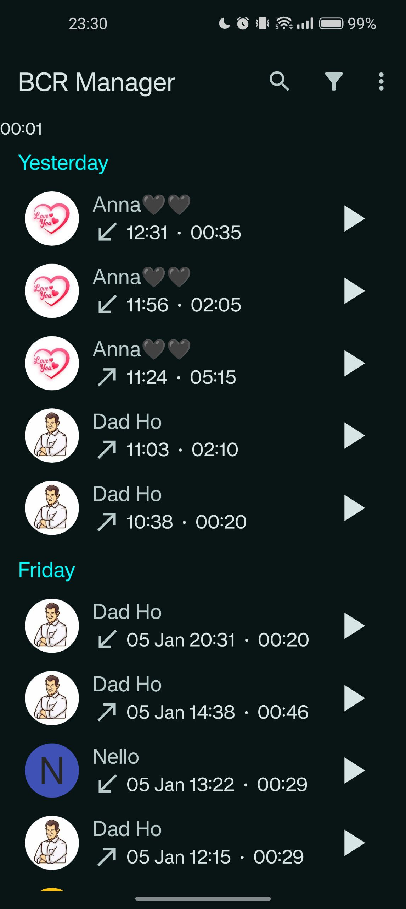
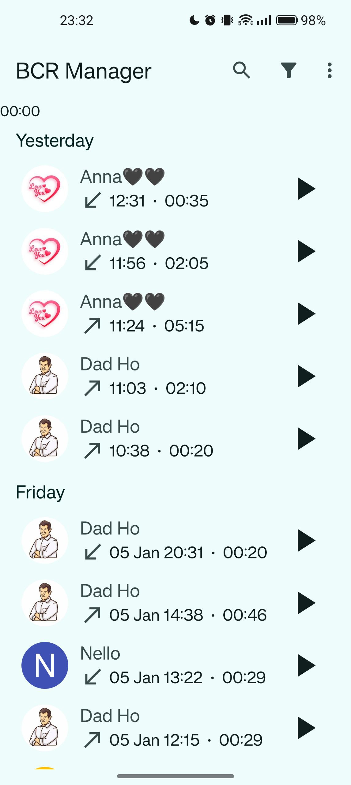

# Basic Call Recorder Manager (BCR Manager)

A simple manager for BCR.

  

Since I really love Basic Call Recorder Manager is a simple app to manage registrations saved with BCR.

## Table of Contents

- [Introduction](#introduction)
- [Requirements](#requirements)
- [Features](#features)
- [Permissions](#permissions)
- [How it works](#how-it-works)
- [Feedback](#feedback)
- [Issues](#issues)
- [License](#license)
- [TODOs](#todos)
- [Acknowledgments](#acknowledgments)
- [Screenshots](#screenshots)
- [Donations](#donations)

## Introduction

This is a simple app, that I have developed for myself. The purpose of this app is to manage all records and simply search and listen.
You can add some breakpoints to every registration, and mark any registration as starred, so when open the app, you will find starred on top.
The app has Dynamic Shortcuts too, based on the count of registrations per-contact.
I'm not a professional developer, so the code is not perfect. I've tested the app on A13 and A14.

## Requirements

If you want to use BCR Manager, you need BCR 1.49 (or newer), because the app needs the JSON Metatada from BCR.
So you you have BCR, ensure to enable "Write JSON Metadata".

## Features

A few of the things you can do with BCR Manager:

* Listen your recordings
* Filter your recordings
* Share and delete recordings
* Batch delete recordings (e.g. per-contact and/or per-date and/or per-duration)
* Mark a recording as starred
* Create breakpoints for every recording

## Permissions

This app requires the following permissions, but it's not mandatory:

`android.permission.READ_CALL_LOG`

Permission to read Call Log, for getting the contact name (and business name if contact not saved) based on Call Log

`
android.permission.READ_CONTACTS
`
Permission for Read Contacts: needed to get the contact name, all contact's numbers and contact pictures.
Contacts numbers are used for dynamic shortcuts.

`
android.permission.READ_PHONE_STATE
`
Permission to Read Phone State: to get VoiceMail's number, Emergency number (for creating the LetterTileDrawable) and numbers of active SIMs.

## How it works
The application asks the Directory where all registrations are saved, then checks all files.
For registrations that has a JSON file, it will parse the JSON file based on Gson Library and get all metadata.
For registrations that hasn't a JSON file, it will parse the filename. Ensure that you have at least date and number in the filename.
It will check in the Call Log for the number and get the contact name (and business name if contact not saved).
If the contact is saved, it will get the contact picture too from Contacts.
When all file are parsed, the app saves all registrations in a JSON file, so on the next open it will load the JSON file instead of parsing all files again.
The app checks for directory changes, so it will know where to parse new files or when a file is deleted.

## Feedback

Feature requests are always welcome. If you want to make a feature request, open a new issue.

## Issues

If you want to report an issue with the app, just open a new issue following

## License

BCR Manager is licensed under GPLv3. Please see [`LICENSE`](./LICENSE.md) for the full license text.

## TODOs
TODOs, but I don't know if I will do it, but if the app will be popular, I will do it.
- Improve code quality
- Add custom Themes (colors)
- Migrate to Kotlin (not necessary)
- Migrate to ViewModel
- Add desktop shortcut per-contact

## Acknowledgments

Thanks to [chenxiaolong](https://github.com/chenxiaolong) for making such a big app [Basic Call Recorder](https://github.com/chenxiaolong/BCR).

## Screenshots
  

## Donations

If you want to support me, you can donate me via PayPal.

